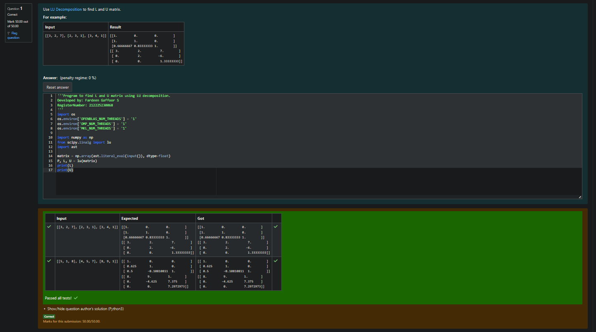
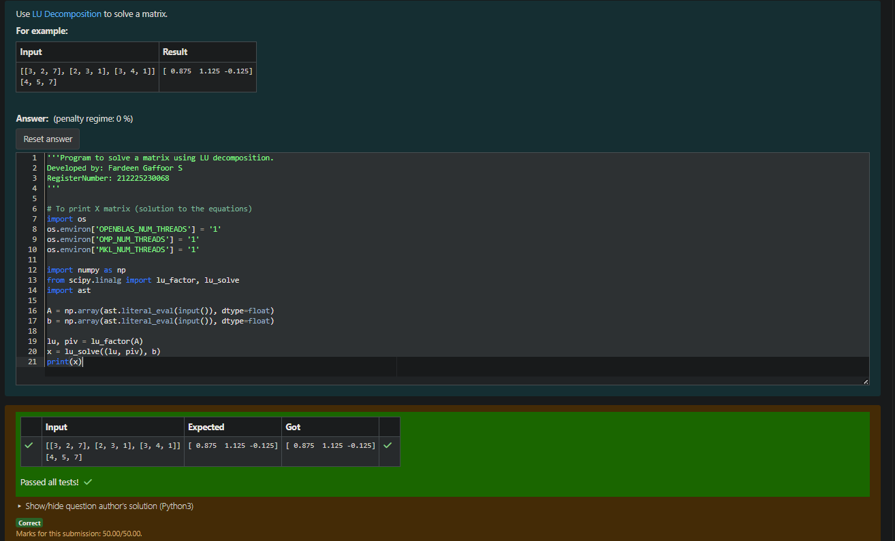

# LU Decomposition 

## AIM:
To write a program to find the LU Decomposition of a matrix.

## Equipments Required:
1. Hardware – PCs
2. Anaconda – Python 3.7 Installation / Moodle-Code Runner

## Algorithm
(i) Algorithm to find the L and U Matrix
Start the program.
Read the order of the matrix n.
Read the elements of matrix A.
Initialize matrices L and U with zeros.
Set diagonal elements of matrix L as 1.
For each row i:

Compute the elements of matrix U using:

U[i][k]=A[i][k]−
j=0
∑
i−1
	​

L[i][j]×U[j][k]

Compute the elements of matrix L using:

L[k][i]=
U[i][i]
A[k][i]−∑
j=0
i−1
	​

L[k][j]×U[j][i]
	​

Display matrices L and U.
Stop the program.

## Program:
(i) To find the L and U matrix
```
'''Program to find L and U matrix using LU decomposition.
Developed by: Fardeen Gaffoor S
RegisterNumber: 212225230068
'''
import os
os.environ['OPENBLAS_NUM_THREADS'] = '1'
os.environ['OMP_NUM_THREADS'] = '1'
os.environ['MKL_NUM_THREADS'] = '1'

import numpy as np
from scipy.linalg import lu
import ast

matrix = np.array(ast.literal_eval(input()), dtype=float)
P, L, U = lu(matrix)
print(L)
print(U)
```
(ii) To find the LU Decomposition of a matrix
```
'''Program to solve a matrix using LU decomposition.
Developed by: Fardeen Gaffoor S
RegisterNumber: 212225230068
'''

# To print X matrix (solution to the equations)
import os
os.environ['OPENBLAS_NUM_THREADS'] = '1'
os.environ['OMP_NUM_THREADS'] = '1'
os.environ['MKL_NUM_THREADS'] = '1'

import numpy as np
from scipy.linalg import lu_factor, lu_solve
import ast

A = np.array(ast.literal_eval(input()), dtype=float)
b = np.array(ast.literal_eval(input()), dtype=float)

lu, piv = lu_factor(A)
x = lu_solve((lu, piv), b)
print(x)
```

## Output:




## Result:
Thus the program to find the LU Decomposition of a matrix is written and verified using python programming.

